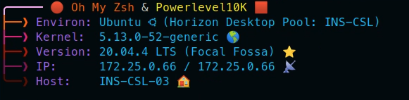
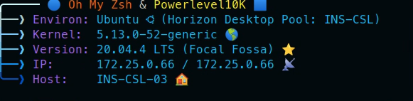
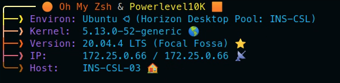
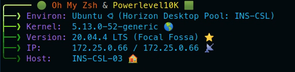
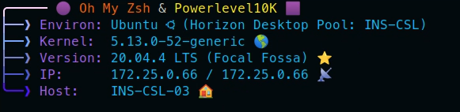

# Terminal Banners

The primary terminal banner in this repo ".banner.rc" was inspired by, and initially based on, the excellent work by [Ben Coleman](https://github.com/benc-uk/dotfiles)

## Updates added for my needs:
- Different Color options (configure at top of file)
- Support for MacOS
- Support for VMware Horizon Desktop Pool (Only displayed if run on VMware Horizon Desktop)

## Example Screenshots: (NOTE: Right side of IP will show Public IP - just showing local for screenshots)

